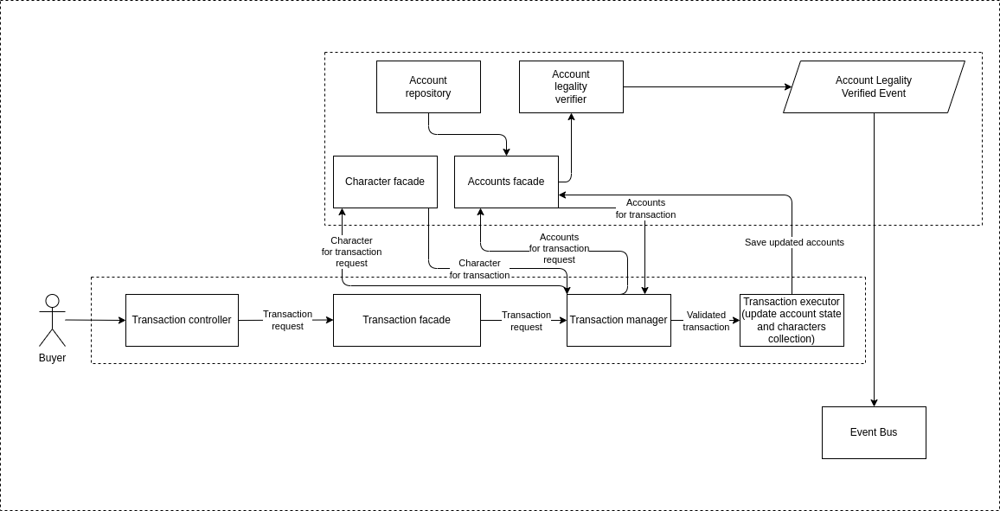

# recruitment-task-fullstack backend API

## Installation 

`yarn install`

## Start

`yarn start`

## Current implementation diagram



## REST API Endpoints:

### Account

1. Account details

    - endpoint: `GET /account`
    - required headers: `user-id`
    - response structure:
        ```ts
            {
                address: string;
                balance: number;
                id: number;
                ownerId: string;
                collection: Character[];
            }
        ```


2. Reset account repository
    - endoint: `POST /account/reset`
    - response structure:
        ```ts
            {
                success: boolean;
            }
        ```

### Characters

1. Character with given id
    - endpoint: `GET /character/1`
    - response structure:
        ```ts
            {
                id: number;
                name: string;
                status: string;
                species: string;
                type: string;
                gender: string;
                origin: {
                    name: string;
                    url: string;
                },
                location: {
                    name: string;
                    url: string;
                },
                image: string;
                episode: string[];
                url: string;
                created: string;
                cost: number;
            }

        ```
2. List of characters:
    - endpoint: `GET /characters` 
    - response structure:
      ```ts
          {         
                id: number;
                name: string;
                status: string;
                species: string;
                type: string;
                gender: string;
                origin: {
                    name: string;
                    url: string;
                },
                location: {
                    name: string;
                    url: string;
                },
                image: string;
                episode: string[];
                url: string;
                created: string;
                cost: number;
            }[]
        ```


### Transaction

1. Buy Character
    - endpoint: `POST /transaction`
    - required headers:  `user-id`
    - required payload structure:  
        ```ts
            {
                characterId: number;
            }
        ```
    - response structure
        ```ts
            {
                success: boolean;
                message: string;
            }

        ```
        